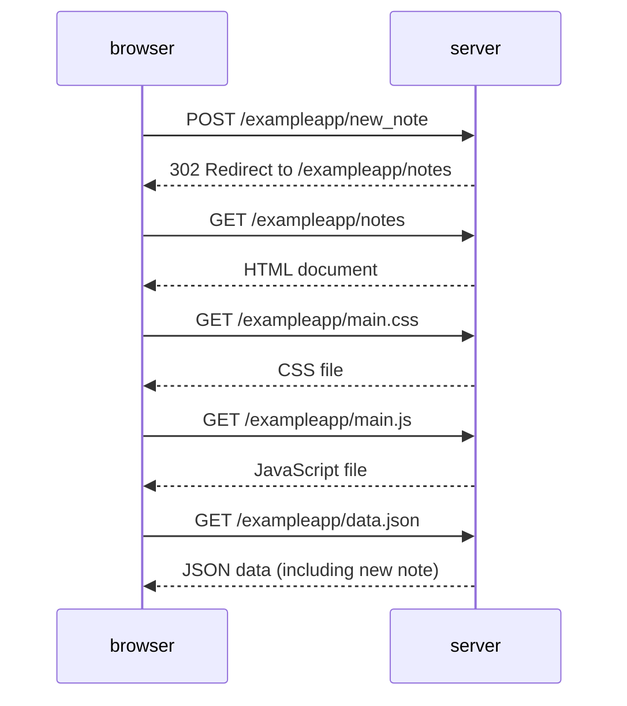

```mermaid
sequenceDiagram
participant browser
participant server

    browser ->> server: POST /exampleapp/new_note
    server -->> browser: 302 Redirect to /exampleapp/notes

    browser ->> server: GET /exampleapp/notes
    server -->> browser: HTML document

    browser ->> server: GET /exampleapp/main.css
    server -->> browser: CSS file

    browser ->> server: GET /exampleapp/main.js
    server -->> browser: JavaScript file

    browser ->> server: GET /exampleapp/data.json
    server -->> browser: JSON data (including new note)
```
